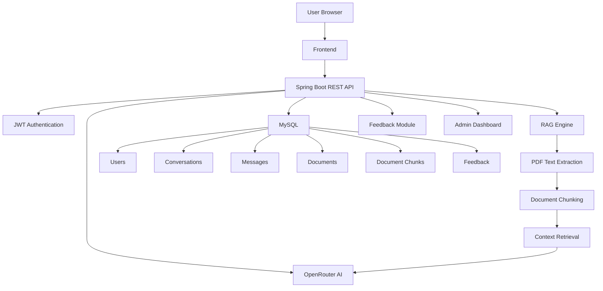

# 🧠 NovaMind – AI Personal Assistant

<p align="center">


</p>

---

## 🚀 Live Demo

### 🌐 Frontend

https://ai-personal-assistant-sable.vercel.app

### ⚙️ Backend API

https://ai-personal-assistant-production-2cfc.up.railway.app

---

# 📖 Overview

NovaMind is a production-ready AI Personal Assistant built using **Java**, **Spring Boot**, **MySQL**, **JWT Authentication**, **OpenRouter AI**, and **Retrieval-Augmented Generation (RAG)**.

It provides an intelligent conversational experience with secure authentication, persistent conversations, AI-powered PDF understanding, feedback collection, and an administration dashboard for analytics.

---

# ✨ Features

## 🔐 Authentication

- User Registration
- User Login
- JWT Authentication
- Role-Based Authorization
- Remember Me
- Secure Password Encryption

---

## 🤖 AI Chat

- AI Conversations
- Streaming Responses
- Multiple Conversations
- Persistent Chat History
- Rename Conversations
- Delete Conversations
- Edit Messages
- Regenerate AI Responses
- Markdown Rendering

---

## 📄 PDF RAG

- Upload PDF Documents
- Extract PDF Text
- Intelligent Document Chunking
- Context Retrieval
- Ask Questions About Uploaded PDFs
- Context-Aware AI Responses

---

## 🎤 Voice Features

- Voice Input
- Speech Recognition Support

---

## 🖥 Dashboard

- Modern Responsive UI
- Light & Dark Theme
- Conversation Sidebar
- Conversation Search
- User Profile
- PDF Context Banner

---

## ⭐ Feedback System

- 5-Star Rating
- Suggestions
- Bug Reports
- Automatic Feedback Popup
- Feedback Analytics

---

## 📊 Admin Dashboard

- Total Users
- Active Users
- Total Feedback
- Average Rating
- Rating Distribution
- User Management
- User Activity Statistics

---

# 🛠 Technology Stack

## Frontend

- HTML5
- CSS3
- JavaScript

---

## Backend

- Java 21
- Spring Boot
- Spring Security
- Spring Data JPA
- REST APIs
- Maven

---

## Database

- MySQL

---

## Artificial Intelligence

- OpenRouter API
- GPT Models
- Retrieval-Augmented Generation (RAG)

---

## Authentication

- JWT

---

## PDF Processing

- Apache PDFBox

---

## Deployment

- Railway
- Vercel

---

# 📂 Project Structure

```
AI-Personal-Assistant

├── backend
│
├── controller
├── service
├── repository
├── entity
├── dto
├── security
├── config
│
├── frontend
│
├── css
├── js
├── login.html
├── register.html
├── dashboard.html
├── admin-dashboard.html
│
├── screenshots
│
└── README.md
```

---

# 🚀 Implemented Features

- Authentication System
- JWT Security
- AI Chat
- Streaming Responses
- Conversation History
- Edit Messages
- Regenerate Responses
- PDF RAG
- PDF Upload
- Feedback Module
- Admin Dashboard
- User Analytics
- Role-Based Authorization
- Responsive UI

---

# 📸 Screenshots

## 🏠 Home Page


---

## 🔑 Login


---

## 📝 Register


---

## 💬 Dashboard


---

## 📄 PDF Chat


---

## ⭐ Feedback


---

## 📊 Admin Dashboard


---

# 🏗 System Architecture



---

# 🚀 Getting Started

## Clone Repository

```bash
git clone https://github.com/santhu1711/AI-Personal-Assistant.git
```

---

## Backend

```bash
cd backend

./mvnw spring-boot:run
```

---

## Frontend

Open

```
frontend/index.html
```

or run using **VS Code Live Server**.

---

# 🌐 Deployment

## Frontend

Vercel

https://ai-personal-assistant-sable.vercel.app

---

## Backend

Railway

https://ai-personal-assistant-production-2cfc.up.railway.app

---

# 🚀 Future Enhancements

- AI Voice Conversation
- Image Upload Support
- Multi-Document RAG
- Docker Support
- Kubernetes Deployment
- AI Agents
- Mobile Application

---

# 👨‍💻 Developer

## Santhosh S

Java Backend Developer

### GitHub

https://github.com/santhu1711

### LinkedIn

https://www.linkedin.com/in/santhosh17

### Live Application

https://ai-personal-assistant-sable.vercel.app

---

# ⭐ Version

**Version 1.0**

---

<p align="center">

Built with ❤️ using Java, Spring Boot, Artificial Intelligence & Modern Web Technologies.

⭐ If you found this project useful, consider giving it a star!

</p>
